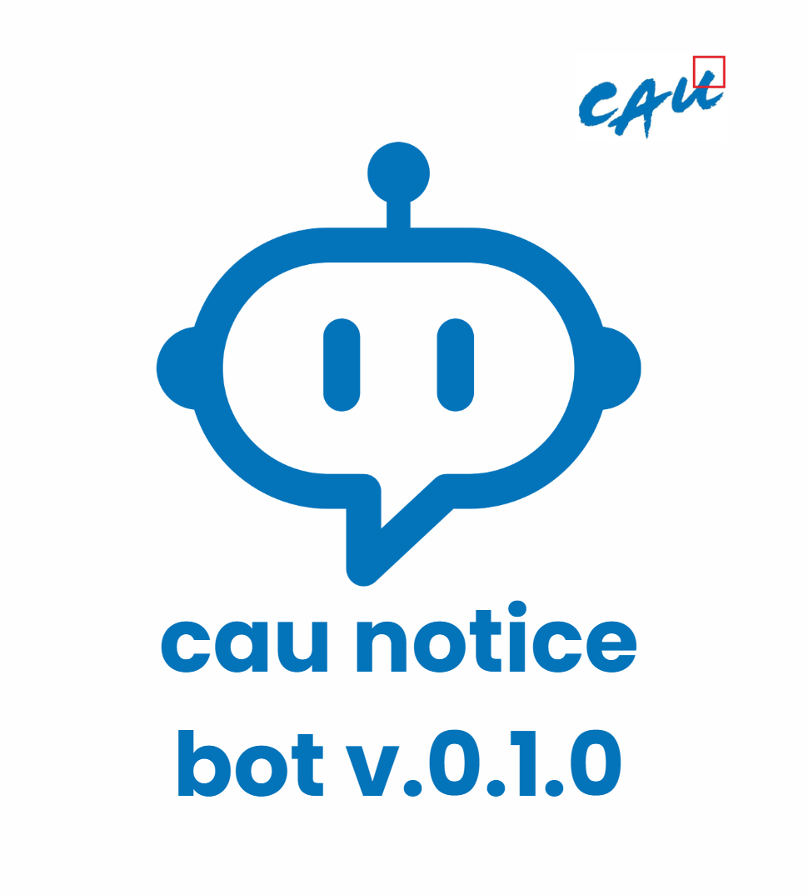

# CAU Notice Bot v.0.1.0

  

중앙대학교 공지사항 알림 텔레그램 봇

## Functions

- 매일 08:00에 전날 08:00부터 당일 08:00까지  중앙대학교 공지사항, 학술정보원 공지사항에서 새로운 공지사항이 등록됐을 경우, 텔레그램으로 알림 전송

- 웹 스크래핑(Crawling) 방식이 아닌 API 호출을 통한 데이터 수집
- Google Cloud Functions를 통한 서버리스 운영

## 기술 스택

- Python 3.9
- Google Cloud Functions
- Google Cloud Secret Manager
- Google Cloud Scheduler
- Telegram Bot API

## Deployment info

[How to deploy v.0.1.0](https://github.com/jpotw/cau-notice-bot/issues/2) 
[FAQ](https://github.com/jpotw/cau-notice-bot/issues/7)

